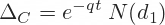
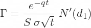
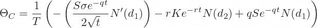
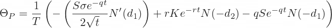
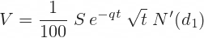
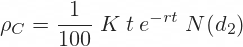
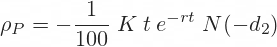

# Black_Scholes_Option_Pricer

This dashboard is able to calculate the live risk free prices for european call and put options, using the Black-Scholes Option Pricing Model. The user can enter the ticker of their desired stock, e.g $AAPL, and the live price is then pulled in from Yahoo Finance.

'The Greeks' generated from the Black-Scholes model are also very useful as they allow the us to view the rate of change of the optino price given changes to underlying variable, such as the risk-free rate. The greeks are calculated by solving the Black-Scholes equation for call and put options, respectively. The results of which are shown below:

## Delta
Delta is the first derivative of option price with respect to underlying price S. The formulas for call and put option delta are the following:

## Gamma
Gamma is the second derivative of option price with respect to underlying price S. It is the same for calls and puts.

Black-Scholes gamma formula

## Theta
Theta is the first derivative of option price with respect to time to expiration t.

Black-Scholes call option thetaBlack-Scholes put option theta
T is the number of days per year.

If T is calendar days (365), then the resulting theta is change in option price per one calendar day (or 1/365 of a year).

If T is trading days (about 252), theta is change in option price per one trading day (or 1/252 of a year).

Without the initial 1/T term, theta would be change per one year, which would be a period too long to be useful for most options.

## Vega
Vega is the first derivative of option price with respect to volatility σ. It is the same for calls and puts.

Black-Scholes vega formula
Note: Divide by 100 to get the resulting vega as option price change for one percentage point change in volatility (if you don't, it is for 100 percentage points change in volatility; same logic applies to rho below).

## Rho
Rho is the first derivative of option price with respect to interest rate r. It is different for calls and puts.

